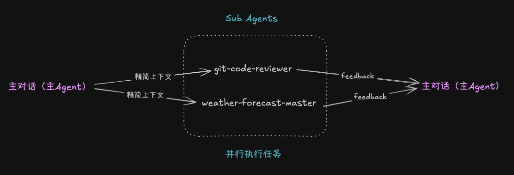
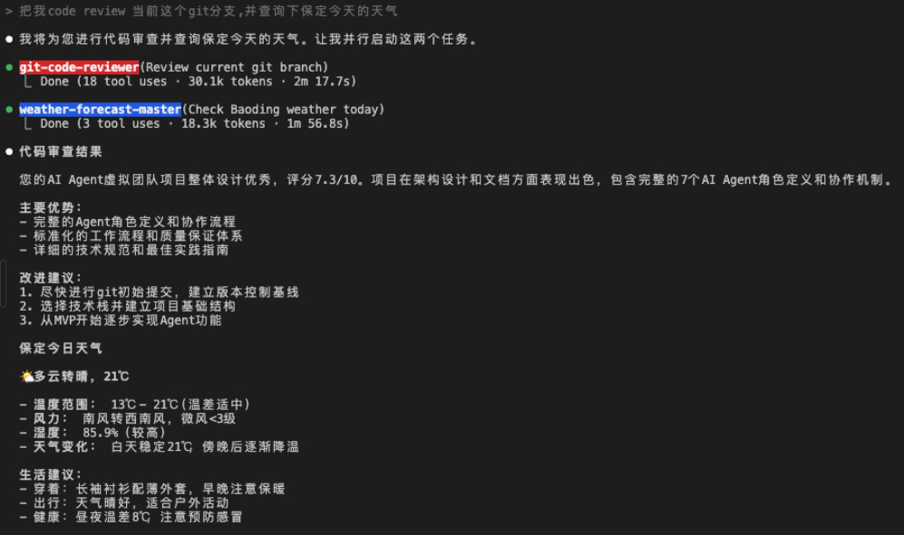

# Claude Code Quickstart

Sep 22, 2025

> **关键词：** `Claude Code` · `Workflow` · `AI 协作` · `项目管理` · `开发流程` · `最佳实践`

---

**阅读时间：** 约 10 分钟

**难度等级：** ⭐⭐ 初中级  
## 1 Workflow

### 1.1 谋

需求和AI先聊清晰

### 1.2 定

转化为 SOP，将任何内容系统化为标准操作流程

举例：提示词（@file，快速引用）

- 基于 @需求文档.md，帮我制定执行计划，标明哪些任务要先做，哪些可以并行，形成一个渐进的 todo.md
- 请你分析这个支付模块的瓶颈，并且给出重构方案

### 1.3 动

按照前期规划和执行方案，进行项目实现。

## 2 进阶用法

### 2.1 Claude Code 狂飙模式

此时可以开启 Claude Code 狂飙模式，提高执行效率：

```markdown
$ claude --dangerously-skip-permissions
```

此时，AI coding 速度拉满，不用担心中间出问题， 因为有git来兜底，除了问题可以回滚。

- **当执行任务过程中，出现超预期错误：** 可以通过按 ESC 键中断任务，及时踩刹车，然后重新输入需求。
- **当执行中出现微小偏差：** 可以补充输入指令，调整执行方向。
- **当执行任务多了：** CC可能会变的不聪明，此时可以执行 /clear 指令，清除记忆。再重新引用 @规划文档，然后告知继续执行，即可。

### 2.2 Extended Thinking 扩展思考模式

- think
- thinkhard
- thinkharder
- ultrathink
    - 使用这个极度思考模式，服务器容易超时
    - 超时出现时，尝试使用 链式思考-chain of thought
        - 让CC把复杂问题，通过自己思考，尝试拆解一下

举例：

```markdown
> thinkhard: next.js项目架构设计。
```

### 2.3 正面表达Prompt

写Prompt时，尽量说让AI做什么，让AI知道该往哪里走；而不是说不让AI做什么，处处设防。不然容易把AI限制住，AI不知道到底该做什么

pros案例

```markdown
> 使用明确的typescript的类型，提取公共逻辑为函数，增加try catch错误处理
```

cons案例

```markdown
> 不要使用Any类型，不要写重复代码，不要忘记错误处理
```

### 2.4 说清验收标准

为了**提升代码质量**，需要提前说清验收标准，这样可以一定程度上降低AI投机取巧，只写出应付测试的代码。

举例：

```bash
> 我要实现一个通用的缓存系统，要求是要适用于所有的合法输入，不只是测试用例，不要硬编码，要实现真正的逻辑，代码要健壮、可维护、可扩展。如何需求不合理，请直接告诉我。
```

### 2.5 长文本优化

写Prompt时，尽量***内容在前指令在后***（模型架构决定）。 可以提高AI模型的理解效果。

```markdown
> [内容: xxx错误日志]，基于上面的错误日志，帮我分析崩溃的原因。
```

### 2.6 commands：自定义命令

在 **.claude/commands/** 目录下，添加 **code_review.md** 的自定义命令文件。

```markdown
<!-- 自定义命令，执行命令时，通过 $ARGUMENTS 占位符，来给自定义命令传递参数。-->
对比这个分支：$ARGUMENTS，与main分支的差异，并提出你的review意见。
```

### 2.7 hook：自定义hook

配置更多功能的hooks，自动化工作流，辅助开发，提高效率。

下面在./setting.json 中，添加一个hook，用于在每次修改文件之后，自动格式化文件。[更多Hook](https://docs.claude.com/en/docs/claude-code/hooks-guide#hook-events-overview)

```json
{
  "hooks": {
    "PostToolUse": [
      {
        "matcher": "Edit|MultiEdit|Write",
        "hooks": [
          {
            "type": "command",
            "command": "npx prettier --check ."
          }
        ]
      }
    ]
  }
}
```

### 2.8 SubAgent

SubAgent就像编程里的子线程，可以让Claude Code在后台开启多个子任务，并行执行，加快了任务的执行效率。

每个SubAgent都专注于一个小功能，以此来提高结果的可预测性，正确使用它来拆解复杂任务，可以提高任务的成功率。

下面来创建几个SubAgent，练练手：

SugAgent-1: 代码审核agent

```bash
> /agent
> 你是代码审核大师，请帮我比较git分支间的代码差异，提出审核意见。
```

SugAgent-2: 查看天气agent

```bash
> /agent
> 你是一个天气预报大师，你用联网工具查询天气。
```

执行流程解析：

```bash
> 帮我code review 当前这个git分支, 并查询下保定今天的天气。
```


执行结果：



### 2.9 使用量查看

[**ccusage**](https://github.com/ryoppippi/ccusage) - A CLI tool for analyzing Claude Code usage from local JSONL files.

```bash
$ npx ccusage@latest
```

### 2.10 恢复历史对话

仅恢复对话内容，不会恢复文件操作（代码）。

```bash
> /resume
```

**/resume** 回车，会出现历史话题，选择一个历史话题，回车进入话题。再敲两下 **ESC** 键，会展示当前话题中的具体对话列表，选择想要回退的对话即可完成会话回退。

### 2.11 无头模式

```markdown
> claude -p 这项目有多少文件?
```


## 3 Github集成

安装git的cli工具:

```markdown
$ brew install gh
```

该仓库下 Claude Code 指令：

```markdown
> 查看 issue #1的内容，并进行修复，创建一个新的修复分支 bugfix-1，然后推送到 Github
```

## 4 参考

- https://www.youtube.com/watch?v=sOvi9Iu1Dq8
- https://www.youtube.com/watch?v=e5O8A5pcVgg