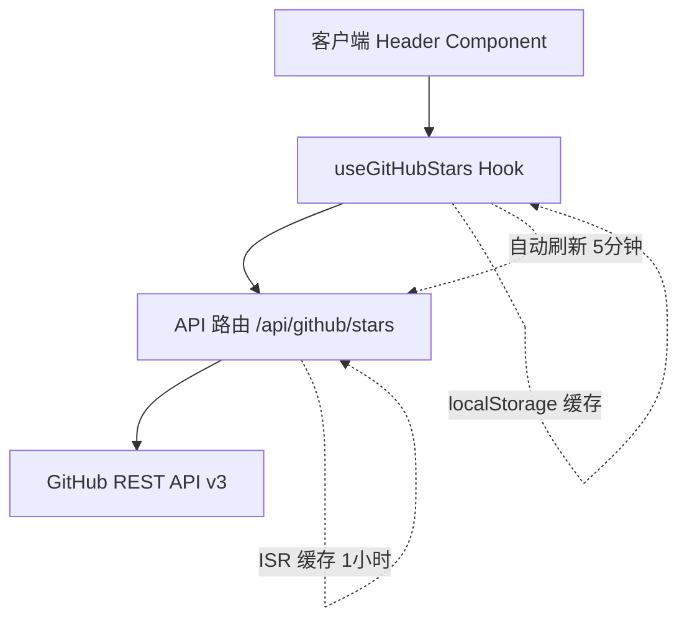
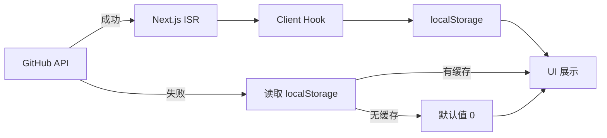

# Next.js Monorepo 中集成 GitHub API：环境变量加载与多层缓存实践

Dec 29, 2025

> **关键词：** `Next.js` · `Monorepo` · `GitHub API` · `环境变量` · `ISR 缓存`

---

## 需求背景

在为开源项目添加 GitHub star 数展示功能时，遇到了 Monorepo 环境下环境变量无法正确加载的问题。这个看似简单的需求，实际涉及 Next.js 配置、环境变量管理、多层缓存设计等多个技术点。本文记录完整的解决方案和踩坑经验。

项目使用 pnpm workspace 管理 Monorepo，目录结构如下：

```bash
agent-flow/
├── apps/
│   └── web/          # Next.js 应用
├── packages/         # 共享包
└── .env              # 根目录环境变量
```

需要在 Header 组件中展示 GitHub 仓库的实时 star 数，替换硬编码的假数据。核心要求：

1. 从 GitHub API 获取真实数据
2. 多层缓存保证性能和可用性
3. Monorepo 环境变量分层管理

---

## 技术方案

### 架构设计

采用四层架构，从客户端到数据源逐层缓存：



### 多层缓存策略

| 层级 | 位置         | 有效期   | 目的            |
| ---- | ------------ | -------- | --------------- |
| L1   | localStorage | 永久     | 离线/失败时回退 |
| L2   | React 状态   | 会话期间 | 避免重复请求    |
| L3   | Next.js ISR  | 1 小时   | 减少 API 调用   |
| L4   | GitHub API   | 实时     | 数据源          |

**数据流向**：



---

## 问题解决过程

### 问题 1：仓库路径末尾斜杠导致 404

**现象**：

配置环境变量时不小心在路径末尾加了斜杠：

```bash
NEXT_PUBLIC_GITHUB_REPO="sggmico/agent-flow/"
```

导致请求 GitHub API 时返回 404：

```bash
https://api.github.com/repos/sggmico/agent-flow/
# GitHub API 不接受末尾斜杠
```

**解决方案**：

在代码中自动移除末尾斜杠：

```typescript
const GITHUB_REPO = (
  process.env.NEXT_PUBLIC_GITHUB_REPO || "yourusername/agent-flow"
).replace(/\/+$/, "");
```

这样即使配置错误也能自动修正，提高容错性。

---

### 问题 2：Monorepo 环境变量分层加载

**问题描述**：

在 Monorepo 项目中，需要实现环境变量的分层管理：

- **后端共享变量**（如 DATABASE_URL、REDIS_URL）应在根目录 `.env` 统一配置
- **客户端暴露变量**（如 NEXT_PUBLIC_GITHUB_REPO）应在 app 层 `.env.local` 配置
- Next.js 默认只加载应用目录下的 `.env` 文件，无法读取根目录配置

**解决方案**：

在 `next.config.ts` 中实现**分层加载**机制：

```typescript
// apps/web/next.config.ts
import { resolve } from "node:path";
import { config } from "dotenv";

const monorepoRoot = resolve(__dirname, "../../");
const appRoot = __dirname;

// L1: 加载全局后端共享变量
config({ path: resolve(monorepoRoot, ".env") });

// L2 + L3: 加载 App 私有变量（包括 NEXT_PUBLIC_*）
// 使用 override: true 确保 app 私有配置可以覆盖全局配置
config({ path: resolve(appRoot, ".env.local"), override: true });

export default {
  // 其他配置...
};
```

安装依赖：

```bash
pnpm add -D -w dotenv @types/node
```

**分层模型**：

| 层级  | 位置                  | 变量类型          | 优先级 | 示例                                  |
| ----- | --------------------- | ----------------- | ------ | ------------------------------------- |
| L0    | Docker/CI             | 系统注入          | 最高   | CI 环境变量                           |
| L2/L3 | `apps/web/.env.local` | App 私有 + Client | 高     | `NEXT_PUBLIC_GITHUB_REPO`, `WEB_PORT` |
| L1    | `/.env`               | 后端共享          | 中     | `DATABASE_URL`, `REDIS_URL`           |

**配置示例**：

```bash
# /.env (后端共享)
DATABASE_URL="postgresql://..."
REDIS_URL="redis://..."
OPENAI_API_KEY="sk-..."

# apps/web/.env.local (App 私有 + Client)
NEXT_PUBLIC_GITHUB_REPO="sggmico/agent-flow"
NEXT_PUBLIC_APP_URL="http://localhost:3000"
GITHUB_TOKEN=""              # Web 专用（提高 GitHub API 限制）
WEB_PORT=3000
```

**核心规则**：

- ✅ 后端共享变量 → 根 `.env`（DATABASE_URL、\*\_API_KEY）
- ✅ Client 暴露变量 → app `.env.local`（NEXT*PUBLIC*\*）
- ✅ App 私有变量 → app `.env.local`（WEB_PORT）
- ❌ 禁止在根 `.env` 定义 NEXT*PUBLIC*\*

**优势**：

- ✅ **职责清晰**：后端共享与客户端暴露分离
- ✅ **安全性**：NEXT*PUBLIC*\* 只在需要的 app 层定义
- ✅ **可维护性**：统一的分层规范，易于团队协作
- ✅ **优雅覆盖**：App 层配置可覆盖全局配置

---

## 代码实现

### 1. API 路由

核心逻辑（`apps/web/src/app/api/github/stars/route.ts`）：

```typescript
export async function GET() {
  const url = `https://api.github.com/repos/${GITHUB_REPO}`;

  const response = await fetch(url, {
    headers: {
      Accept: "application/vnd.github.v3+json",
      Authorization: GITHUB_TOKEN ? `Bearer ${GITHUB_TOKEN}` : undefined,
    },
    next: { revalidate: 3600 }, // ISR: 缓存 1 小时
  });

  const data = await response.json();

  return NextResponse.json({
    stars: data.stargazers_count,
    forks: data.forks_count,
    watchers: data.watchers_count,
  });
}
```

**关键点**：`next: { revalidate: 3600 }` 启用 ISR 服务端缓存，错误处理交给客户端

---

### 2. 自定义 Hook

核心逻辑（`apps/web/src/hooks/use-github-stars.ts`）：

```typescript
export function useGitHubStars() {
  const [stats, setStats] = useState(() => getCachedStats() || { stars: 0 });

  useEffect(() => {
    const fetchStars = async () => {
      const response = await fetch("/api/github/stars");
      const data = await response.json();

      if (data.stars > 0) {
        setStats(data);
        localStorage.setItem("github_stats_cache", JSON.stringify(data));
      } else {
        setStats(getCachedStats() || { stars: 0 });
      }
    };

    fetchStars();
    const interval = setInterval(fetchStars, 5 * 60 * 1000);
    return () => clearInterval(interval);
  }, []);

  return stats;
}
```

**关键特性**：懒初始化从缓存读取，5 分钟自动刷新，失败时回退到 localStorage

---

### 3. Header 组件集成

```typescript
import { useGitHubStars } from "@/hooks/use-github-stars";
import { Github, Star } from "lucide-react";

export function Header() {
  const { stars, loading } = useGitHubStars();

  return (
    <header className="border-b">
      <div className="flex items-center justify-between px-6 py-4">
        <div className="flex items-center space-x-4">{/* Logo */}</div>

        <a
          href={`https://github.com/${
            process.env.NEXT_PUBLIC_GITHUB_REPO || "yourusername/agent-flow"
          }`}
          target="_blank"
          rel="noopener noreferrer"
          className="flex items-center space-x-2 text-sm hover:text-primary"
        >
          <Github className="h-4 w-4" />
          <Star className="h-4 w-4 fill-yellow-400 text-yellow-400" />
          <span className="font-semibold">
            {loading ? "..." : stars.toLocaleString()}
          </span>
        </a>
      </div>
    </header>
  );
}
```

---

## 关键技术决策

### 1. 为什么用 Next.js ISR 而不是 SWR?

**选择**：Next.js 内置的 ISR（Incremental Static Regeneration）

**理由**：

- **服务端缓存**：减少对 GitHub API 的请求次数，GitHub 未认证限制为 60 次/小时
- **零额外依赖**：Next.js 原生支持，无需安装 SWR/React Query
- **CDN 友好**：生产环境可利用 Vercel Edge Network
- **简单直接**：一行代码搞定 `next: { revalidate: 3600 }`

**权衡**：SWR 提供更灵活的客户端缓存和乐观更新，但会增加包体积且无法解决 API 限流问题。对于这个场景，服务端缓存优先级更高。

---

### 2. 为什么用 dotenv 而不是 @next/env 或软链接?

**选择**：`next.config.ts` 中使用 dotenv 分层加载

**理由**：

1. **@next/env 的适用场景**：

   - `@next/env` 是 Next.js 官方提供的独立包，需要单独安装：`npm install @next/env`
   - 提供 [`loadEnvConfig`](https://nextjs.org/docs/pages/guides/environment-variables) 函数，主要用于 **Next.js 运行时之外**的场景：
     - 测试文件和 Jest 配置
     - ORM 配置文件（如 Drizzle、Prisma）
     - 独立脚本和数据迁移
   - 对于 `next.config.ts` 中的环境变量加载，dotenv 更简单直接

2. **优雅性**：

   - 避免文件系统操作，纯代码配置
   - 支持分层加载，符合 Monorepo 规范

3. **跨平台**：

   - 软链接在 Windows 上支持不佳
   - dotenv 在所有平台一致

4. **明确性**：
   - 配置文件中加载逻辑一目了然
   - 易于理解和维护

**对比其他方案**：

| 方案                | 优点                                | 缺点                           | 适用场景                   |
| ------------------- | ----------------------------------- | ------------------------------ | -------------------------- |
| @next/env           | 官方推荐，与 Next.js 一致的加载逻辑 | 需单独安装，主要用于运行时之外 | 测试、ORM 配置、脚本 ✅    |
| 软链接              | 无需代码改动                        | 不跨平台（Windows），隐式依赖  | 仅限 Unix/Mac 环境         |
| dotenv-cli          | 简单直接                            | 每个脚本都要加前缀             | 快速原型                   |
| **dotenv 分层加载** | **优雅、明确、跨平台、支持分层**    | **需手动配置**                 | **next.config.ts 场景** ✅ |

---

### 3. 缓存失效策略：为什么客户端 5 分钟而服务端 1 小时?

**选择**：

- 客户端自动刷新：5 分钟
- 服务端 ISR：1 小时

**理由**：

1. **平衡实时性与性能**：

   - GitHub stars 变化不频繁，1 小时缓存足够
   - 客户端 5 分钟刷新提供"相对实时"的体验

2. **减少 API 调用**：

   - 60 次/小时限制下，1 小时 ISR 确保不超限
   - 多用户访问时共享服务端缓存

3. **离线可用**：
   - localStorage 永久缓存，离线时仍可显示历史数据

**数学验证**：

```
假设 100 个用户同时访问：
- 无缓存: 100 次 API 调用 ❌ 超限
- ISR 1小时: 1 次 API 调用 ✅ 安全
```

---

## 注意事项

### 1. GitHub API 限流

**未认证限制**：60 次/小时（按 IP 计算）
**认证限制**：5000 次/小时（按 Token 计算）

**建议**：

- 生产环境必须配置 `GITHUB_TOKEN`
- 监控 API 响应头 `X-RateLimit-Remaining`
- 考虑降级策略（超限时显示缓存值）

**创建 Token**：

1. 访问 https://github.com/settings/tokens
2. 生成新 Token，只需要 `public_repo` 权限
3. 配置到环境变量：`GITHUB_TOKEN="ghp_xxxxxxxxxxxx"`

---

### 2. SSR/SSG 兼容性

**问题**：localStorage 仅在浏览器可用，服务端渲染时会报错

**解决方案**：

```typescript
if (typeof window === "undefined") return null;
```

**避免 hydration 错误**：

初始状态使用缓存值而非 0，避免客户端和服务端不一致：

```typescript
const [stats, setStats] = useState<GitHubStats>(() => {
  const cached = getCachedStats();
  return cached || { stars: 0, forks: 0, watchers: 0 };
});
```

---

## 总结

在 Next.js Monorepo 中集成 GitHub API，核心挑战在于环境变量的正确加载和多层缓存的合理设计。本文提供的解决方案包括：

1. **环境变量管理**：通过 `next.config.ts` 实现 dotenv 分层加载（L1 全局后端共享 + L2/L3 App 私有），`NEXT_PUBLIC_*` 变量在 app 层定义，客户端和服务端均可访问
2. **多层缓存**：localStorage（永久）+ React 状态（会话）+ ISR（1 小时）+ GitHub API（实时），保证性能和可用性
3. **容错设计**：自动移除路径斜杠、API 失败时回退到缓存、SSR 兼容性处理

完整代码已集成到项目中，可直接参考和复用。

---

## 关于 Agent Flow

**Agent Flow** 是一个 AI Agent 协作平台，让开发者能够通过可视化界面创建、编排和监控 AI Agent。本文的实践来自项目开发过程，所有代码均在生产环境中验证。

🌟 **GitHub 仓库**：[sggmico/agent-flow](https://github.com/sggmico/agent-flow)

如果本文对你有帮助，欢迎 Star 支持！也欢迎在 Issues 中讨论 Monorepo 和 Next.js 的最佳实践。
