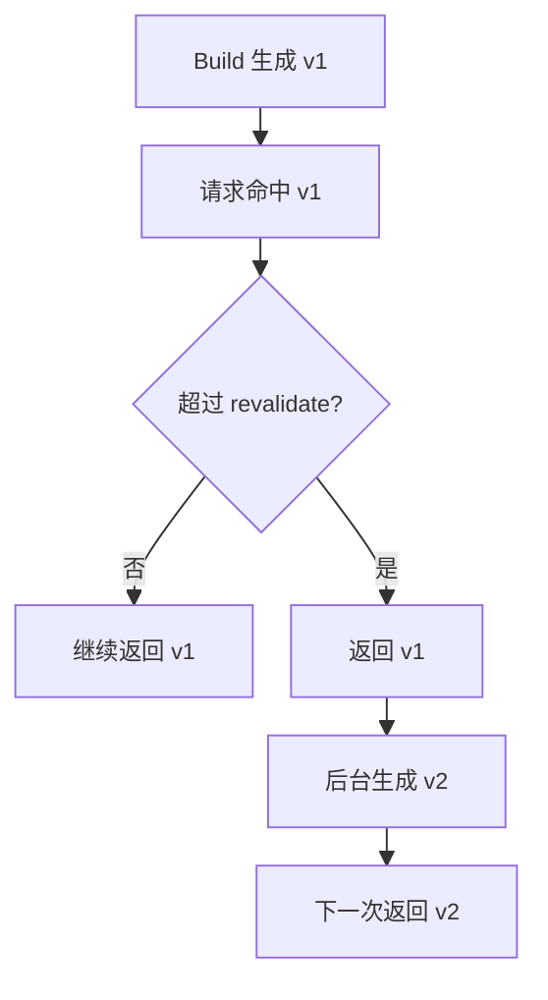
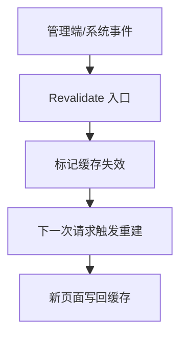
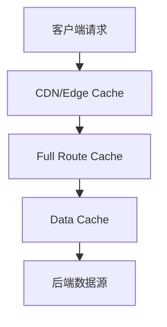
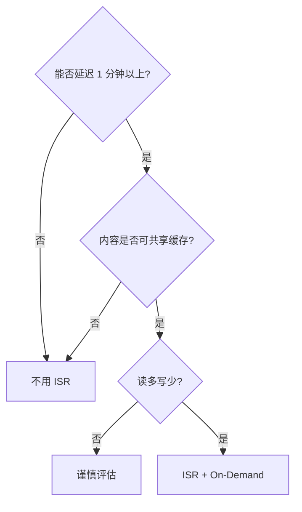

# Next.js ISR 增量静态生成：原理、实战与常见坑

Jan 15, 2026

> **关键词：** `Next.js` · `ISR` · `增量静态生成` · `缓存` · `App Router`

---

如果你做过内容站或商品库，一定遇到过这个矛盾：页面要快，但内容又要新。全量 SSG 快，但更新慢；SSR 更新快，但成本高。ISR 的价值就在这里：把“静态”做成默认，把“更新”变成按需。

这篇文章会讲清楚三件事：它怎么工作、App Router 怎么用、线上会踩哪些坑。内容以 Next.js 13+ App Router 为主，同时保留 Pages Router 的关键写法。顺带结合项目里的一个案例，让它更具体。

## ISR 的一句话定义

ISR（Incremental Static Regeneration）是 **“可以在运行期按需刷新”的静态页面**。页面还是静态 HTML，但在超过 `revalidate` 时间窗口（单位：秒）后，下一次请求会触发后台再生成，然后用新版本替换旧版本。

### 关键点速记

- **静态**：响应快，CDN 友好。
- **增量**：只更新访问到的页面，不全量重建。
- **再生**：后台异步生成，不阻塞当前请求。

补一句：**过期后的首个请求仍返回旧内容，更新发生在后台**。

## ISR 解决的不是“实时”，而是“可控更新”

ISR 不适合股票、交易、聊天这种实时数据。它的目标是 **“内容更新可控”**，比如：

- 博客、新闻、帮助文档
- 商品详情页（可以接受 1~5 分钟延迟）
- 榜单、排行榜、热门列表

一句话：**能接受几分钟延迟的内容型页面，优先考虑 ISR。**

### 适配性小结

| 场景 | 是否适合 ISR | 理由 |
| --- | --- | --- |
| 博客/文档 | 是 | 读多写少，容忍延迟 |
| 商品详情 | 是 | 可以容忍分钟级更新 |
| 实时聊天 | 否 | 需要毫秒级一致 |

## ISR 生命周期：更准确的心智模型

下面是关键的生命周期：



注意：**“过期后”也不会阻塞当前用户**。这就是 stale-while-revalidate 的策略。

## Pages Router：最经典的 ISR 用法

你可能还在维护 Pages Router，这里是标准写法：

```typescript
// pages/posts/[slug].tsx
export async function getStaticProps({ params }) {
  const post = await fetchPost(params.slug);

  return {
    props: { post },
    revalidate: 60, // 60 秒后允许后台再生成
  };
}

export async function getStaticPaths() {
  const slugs = await fetchHotSlugs();
  return {
    paths: slugs.map((slug) => ({ params: { slug } })),
    fallback: 'blocking',
  };
}
```

这里有两个常见误解，实际线上最容易踩：

1. **revalidate 不是“定时更新”，而是“过期后下一次访问触发”。**
2. **fallback='blocking' 是 ISR 的关键搭档**，它让长尾页面按需生成。

## App Router：从“页面级”变成“数据级”

App Router 把 ISR 从“页面级”下沉到“数据级”。你可以在 fetch 粒度上控制缓存：

```typescript
// app/posts/[slug]/page.tsx
async function getPost(slug: string) {
  const res = await fetch(`https://api.example.com/posts/${slug}`, {
    next: { revalidate: 60 },
  });

  if (!res.ok) {
    throw new Error('Failed to fetch post');
  }

  return res.json();
}

export default async function Page({ params }: { params: { slug: string } }) {
  const post = await getPost(params.slug);

  return <ArticleView post={post} />;
}
```

也可以让整个路由段统一设置：

```typescript
// app/posts/[slug]/page.tsx
export const revalidate = 60;
```

App Router 的核心变化是：**缓存控制变成了“数据请求的属性”**。这让你更容易做局部刷新，比如页面里的一块“热门推荐”用 ISR，另一块“用户数据”走动态请求。

## On-Demand Revalidation：真正的生产级玩法

定时刷新不够精确，CMS 发布、后台改价都需要“立即生效”。这时就用 On-Demand Revalidation，适合接 Webhook 或后台按钮触发。

它的核心动作只有一件事：**让缓存失效**。但失效的对象不同，触发路径也不同。




**执行链路拆解**：
1. **触发入口**：Webhook、管理后台按钮、Server Action，都可以作为入口。
2. **失效目标**：`revalidatePath` 失效单个路由，`revalidateTag` 失效一类数据。
3. **重建时机**：不会立刻生成新页面，而是等“下一次请求”触发重建。
4. **写回缓存**：重建成功后，更新 Data Cache 和 Full Route Cache。

下面来看下，项目中是如何标记失效对象的：

**Pages Router：**

```typescript
// pages/api/revalidate.ts
export default async function handler(req, res) {
  if (req.query.secret !== process.env.REVALIDATE_TOKEN) {
    return res.status(401).json({ message: 'Invalid token' });
  }

  try {
    await res.revalidate('/posts/hello');
    return res.json({ revalidated: true });
  } catch (error) {
    return res.status(500).json({ message: 'Revalidate failed' });
  }
}
```

代码说明：

- `req.query.secret` 是简单鉴权入口，避免被外部随意触发。
- `res.revalidate('/posts/hello')` 按路径标记失效对象。
- 响应成功只表示“标记成功”，真正重建发生在下一次请求。

**App Router：**

```typescript
// app/actions/revalidate.ts
'use server';

import { revalidatePath, revalidateTag } from 'next/cache';

export async function revalidatePost(slug: string) {
  revalidatePath(`/posts/${slug}`);
}

export async function revalidateProducts() {
  revalidateTag('products');
}
```

代码说明：

- `revalidatePath` 失效单条路由路径。
- `revalidateTag` 失效一类数据，适合多页面共享数据。
- 触发点通常是 Server Action 或 Route Handler。

如果你是内容站，**revalidateTag** 很好用：一个标签，刷新多条路径。建议配合鉴权与速率限制，避免误触发。

## ISR 实战：GitHub Stars 缓存 1 小时

在实际项目中有一个很小的 ISR 用例，用在 API Route 里缓存 GitHub 仓库信息：

```typescript
// apps/web/src/app/api/github/stars/route.ts
const response = await fetch(url, {
  headers,
  next: { revalidate: 3600 }, // ISR 缓存 1 小时
});
```

意义很直接：

- GitHub API 有速率限制，不需要每次请求都打过去。
- 1 小时的更新频率对 stars/forks 这种指标很够用。
- 失败时返回兜底数据，页面不至于崩。

如果你的页面里也有类似“第三方统计数据”，这个模式非常稳，且能显著减少外部 API 配额消耗。

## ISR 的缓存层次：别只盯着 revalidate

在 App Router 里，缓存不止一层。下面这个分层更直观：



简化记忆：**Data Cache 控数据，Full Route Cache 控页面，CDN 控分发。** Data Cache 失效后会触发重新渲染并更新页面缓存。

## 常见坑

下面是线上最常见的几类问题，配了直接可执行的建议。

| 问题            | 表现      | 建议                              |
| ------------- | ------- | ------------------------------- |
| 开发模式误判        | ISR 不生效 | 用 `next build && next start` 验证 |
| CDN 叠加缓存      | 更新延迟    | 对齐 CDN 缓存策略                     |
| 多实例不一致        | A 新 B 旧 | 用共享缓存或平台能力                      |
| revalidate 太短 | 数据库抖动   | 不要低于业务能承受频率                     |
| 私有数据误用        | 数据泄露    | 用户级数据走 SSR/CSR                  |

## 实战选型：一眼判断

用这个“3 条判断”足够做决策：



如果你想更精细一点，可以参考更多维度：

| 维度 | 建议 |
| --- | --- |
| 更新频率 | ≥ 60s 适合 ISR |
| 数据属性 | 公共数据适合 ISR |
| 流量形态 | 高并发读很划算 |

## 结尾：ISR 是一种工程折中

ISR 不是“更快的 SSR”，也不是“更灵活的 SSG”。它是一个折中：**用时间换一致性，用缓存换性能**。如果你能接受这个折中，它几乎是内容站的最佳选择。

如果你想继续深入，可以从这三块继续：

- App Router 的缓存策略全景图（Data Cache / Route Cache / Client Cache）
- CDN 与 ISR 的缓存协作路径
- 大规模内容站（10 万页面）如何做预热与回收
