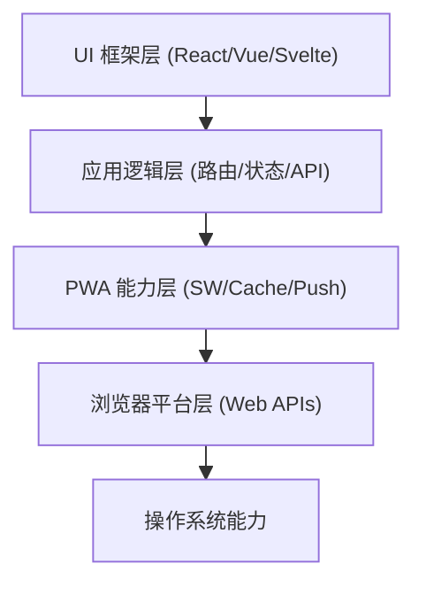

> **关键词：** `PWA` · `Service Worker` · `Web App Manifest` · `离线缓存` · `工程实践`

---

本文为你提供一个清晰的 PWA 判断框架，并带你走完从 0 到 1 的最小闭环实现。目标读者是有一定前端经验、希望把 Web 应用升级为“可安装、可离线、可维护”的工程师。

本文配套的示例代码已上传至 GitHub，欢迎 Clone 学习：[GitHub 仓库链接](https://github.com/LearnFlowAI/starter)

本文将首先阐明 PWA 的适用场景，然后深入剖析其核心技术与分层定位，最后通过真实代码路径，手把手带你完成一次“工程化升级”。

## 先判断：你的项目适合做 PWA 吗？

我通常会用三个问题做快速筛选：

-   **用户是否经常处于弱网或离线环境？** （例如，地铁、户外、网络不稳定的地区）
-   **是否希望提升用户留存，但又不想走复杂的应用商店分发？**
-   **现有 Web 体验是否已经足够完善，只缺少离线、安装、推送这些“临门一脚”的能力？**

如果这三个问题里命中两个或以上，PWA 绝对值得投入。反之，如果你的产品严重依赖底层系统能力（如复杂的音视频处理、深度文件系统访问），那么 PWA 可能只适合作为补充方案。

## PWA 的位置：是能力层，而非 UI 框架

很多开发者初次接触 PWA 时，会误以为它是类似 React/Vue 的框架。实际上，它更像一层嫁接在现有 Web 应用之上的**能力增强层**，旨在将 Web 的体验拉近至原生 App 水平。

下面这个分层图在做方案评审时经常用，可以清晰地展示 PWA 在技术栈中的位置：



结论很直接：你可以在完全不改动现有 UI 技术栈（React/Vue 等）的前提下，将 PWA 作为一项纯粹的能力增强平滑接入。这也是它在工程实践中最实际的价值。

## 三大支柱：缺一不可

### 1. Service Worker：离线与缓存的核心

Service Worker (SW) 是 PWA 离线体验的基石。它是一个在浏览器后台独立于页面的脚本，能够拦截和处理网络请求、管理缓存、执行后台同步等任务。经验之谈：只要离线体验做得好，用户对“应用感”的感知会立刻提升一个台阶。

### 2. Web App Manifest：定义应用身份与外观

`manifest.json` 文件是一个标准的 JSON 文件，它向浏览器描述了你的应用名称、图标、启动方式、主题颜色等元信息。它直接决定了用户“添加到主屏幕”后的视觉表现，与品牌体验密切相关。

### 3. HTTPS：不仅是安全，更是权限门票

Service Worker、Push API 等强大的 PWA 功能都强制要求在 HTTPS 环境下运行。因此，HTTPS 不仅仅是一个安全要求，更是开启 PWA 能力的“权限开关”。这个点经常被新手忽略，我就曾踩过坑：在测试环境忘记配置 HTTPS，导致缓存策略完全不生效，排查了半天才定位到是权限问题。

## 缓存策略：切忌一上来就“全缓存”

对于缓存策略，建议采用循序渐进的方式。先从最简单的 `Network First` 开始，确保数据的新鲜度，再逐步为不同类型的资源引入更复杂的策略。

-   **Cache First**：缓存优先。适合静态资源，如 CSS、JS、字体、图标等。请求优先从缓存中读取。
-   **Network First**：网络优先。适合动态数据，如 API 请求。优先从网络获取最新数据，如果网络失败，则回退到使用缓存中的旧数据。
-   **Stale-While-Revalidate**：后台更新。先立即返回缓存的旧数据（保证速度），同时再去网络请求新数据并更新缓存，供下次使用。适合内容更新频繁但允许短暂延迟的场景，如新闻列表。

一个最小可用的 `fetch` 事件处理逻辑如下，它采用了 **Network First** 策略：

```javascript
const FETCH_ALLOWED_METHOD = "GET";

self.addEventListener("fetch", (event) => {
  if (event.request.method !== FETCH_ALLOWED_METHOD) {
    return;
  }

  // 优先尝试网络请求，获取最新数据
  event.respondWith(
    fetch(event.request).catch(() => {
      // 如果网络请求失败（例如离线），则尝试从缓存中返回匹配的资源
      return caches.match(event.request);
    })
  );
});
```

这段逻辑虽然朴素，但对于 MVP (最小可行产品) 阶段已经足够健壮。

## 最小闭环：基于真实路径的工程拆解

以下流程来自一个实际项目的拆解，你可以参考并映射到自己的项目结构中。

### 1. Manifest：定义应用身份

文件路径：`starter/public/manifest.json`

```json
{
  "name": "LearnFlow Starter",
  "short_name": "LearnFlow",
  "start_url": "/",
  "display": "standalone",
  "background_color": "#F6F1E6",
  "theme_color": "#F6F1E6",
  "icons": [
    {
      "src": "/icon.svg",
      "sizes": "any",
      "type": "image/svg+xml"
    }
  ]
}
```

### 2. Service Worker：实现最小离线能力

文件路径：`starter/public/sw.js`

```javascript
const CACHE_NAME = "learnflow-starter-v1"; // 每次发布新版本时，务必修改此版本号以触发更新
const OFFLINE_URLS = ["/"]; // 需要预缓存以供离线访问的核心 URL 列表

self.addEventListener("install", (event) => {
  event.waitUntil(
    caches
      .open(CACHE_NAME)
      .then((cache) => cache.addAll(OFFLINE_URLS)) // 预缓存关键资源
      .then(() => self.skipWaiting()) // 强制新的 Service Worker 跳过等待，立即激活
  );
});

self.addEventListener("activate", (event) => {
  event.waitUntil(
    caches.keys().then((keys) =>
      Promise.all(
        keys
          .filter((key) => key !== CACHE_NAME) // 筛选出所有旧版本的缓存
          .map((key) => caches.delete(key)) // 清理旧缓存，避免占用过多空间
      )
    )
  );
  self.clients.claim(); // 确保 Service Worker 激活后立即控制所有已打开的页面
});

self.addEventListener("fetch", (event) => {
  if (event.request.method !== "GET") {
    return;
  }

  // 网络优先，失败则回退到缓存
  event.respondWith(
    fetch(event.request).catch(() => caches.match(event.request))
  );
});
```

### 3. 注册时机：仅在客户端安全注册

文件路径：`starter/app/sw-register.tsx`

```tsx
"use client";

import { useEffect } from "react";

export default function SwRegister() {
  useEffect(() => {
    // 检查浏览器是否支持 Service Worker
    if ("serviceWorker" in navigator) {
      navigator.serviceWorker
        .register("/sw.js") // 注册 sw.js 文件
        .catch(() => undefined); // 注册失败时静默处理，避免影响主应用逻辑
    }
  }, []);

  return null;
}
```

### 4. 布局层接入 Manifest

文件路径：`starter/app/layout.tsx`

```tsx
export const metadata: Metadata = {
  title: "LearnFlow",
  description: "专注你的每一次进步",
  manifest: "/manifest.json", // 链接到 manifest 文件
  themeColor: "#F5F7FA" // 确保此颜色与 manifest 中的 theme_color 匹配
};
```

要特别注意：`manifest` 与 `themeColor` 是一对，不一致时会让应用启动页的颜色闪烁或割裂，影响体验。

## 验证步骤：告别“靠感觉”

我习惯使用 Chrome DevTools 的 **Application** 面板进行系统性验证：

1.  **Manifest**：检查 `name`, `start_url`, `icons` 等字段是否被正确加载。
2.  **Service Workers**：确认 `sw.js` 已成功注册并处于“activated and is running”状态。
3.  **Network -> Offline**：勾选 `Offline` 选项，然后刷新页面，首页应能从 Service Worker 缓存中成功加载。
4.  **Install App**：在地址栏或菜单中应该能看到“安装”应用的图标或入口。

这四步能筛掉 80% 以上的 PWA 配置问题。

## 常见问题与排错

-   **安装入口不出现**：检查 `manifest.json` 是否可被网络访问，并且确保当前页面环境是 **HTTPS** 或 `localhost`。
-   **离线不可用**：确认 `sw.js` 注册成功，并在 **Application -> Storage -> Caches** 中检查缓存里是否已包含 `/` 首页。
-   **更新不生效**：务必在每次发布时**提高 `CACHE_NAME` 的版本号**，并在 `activate` 阶段清理掉所有旧版本的缓存。忘记修改缓存名是个人踩过最痛苦的坑之一。

## 进阶路线：从可用到可维护

当你的最小闭环稳定运行后，可以按以下顺序逐步升级 PWA 的能力：

1.  **设计离线兜底页**：预缓存一个专用的 `/offline.html` 页面，在任何请求失败时都返回它，提供更友好的离线提示。
2.  **实现分层缓存**：为不同类型的资源（如页面、JS/CSS、图片、API 数据）设置不同的缓存策略和过期时间。
3.  **提供更新提示**：监听 `registration.waiting` 事件，当新的 Service Worker 准备好时，向用户显示一个“刷新以更新”的提示。
4.  **按需接入 Push 与 Background Sync**：当业务确实需要消息推送或后台同步时再接入，避免过早引入复杂性。
5.  **构建离线数据队列**：对于需要离线提交的表单等功能，可以结合 IndexedDB 做一个可靠的数据同步队列。

## 最后：一个选型判断清单

-   对“离线可用”带来的用户体验提升和业务收益是否明确？
-   业务场景是否真的需要“安装到桌面”来提升用户粘性和留存？
-   团队是否有能力和精力来维护 Service Worker 的版本迭代和缓存管理？

如果这三条你都能给出肯定的答案，PWA 对你来说就是一个高性价比的工程方案。

## 延伸阅读方向

-   **官方文档**: [MDN: Service Worker API](https://developer.mozilla.org/zh-CN/docs/Web/API/Service_Worker_API)
-   **缓存策略**: [web.dev: The Offline Cookbook](https://web.dev/offline-cookbook/)
-   **工程实践**: [Workbox 官方文档](https://developer.chrome.com/docs/workbox/) (一个简化 PWA 开发的库)
-   **选型对比**: [PWA vs. Native vs. Mini-Programs: How to Choose in 2026](https://radixweb.com/blog/pwa-vs-native-apps)

希望这份指南能帮你把 PWA 从一个模糊的“概念”变成一项“可交付的工程能力”。现在，最好的学习方式就是动手改造一个你自己的项目。
