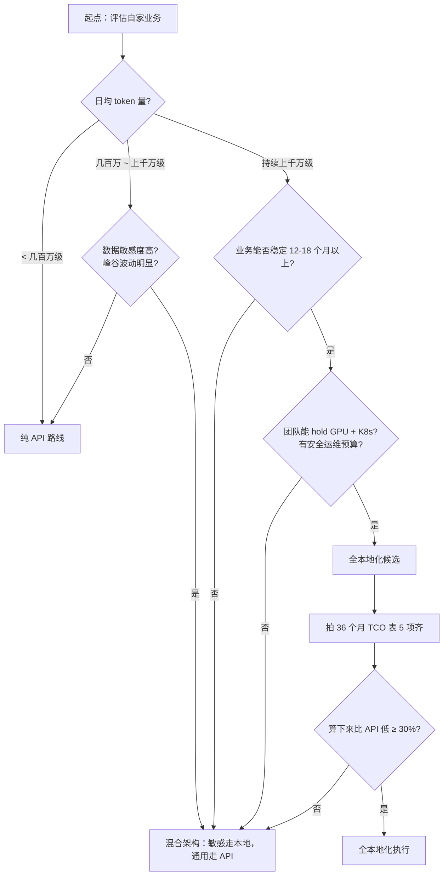

## 摘要

本地化部署大模型不是一句"省钱"的口号，而是一道关于「日均 token 量 × 持续时间 × 真实 TCO × 业务约束」的算术题。本文给出可直接套到自己业务参数的最小成本公式（附 Python 复算函数），列清 TCO 必须算的 5 项，澄清 Ollama / vLLM / SGLang / TensorRT-LLM 的边界，并用 Stripe 与阿里 OpenClaw 两个公开案例做结构对照——读完之后你应该能完成自己的盈亏平衡测算，而不是被某个具体数字带着走。

判断顺序：**先算 token 量，再拍 36 个月 TCO，最后用数据敏感度、延迟要求、运维能力决定要不要混合。**

---

## 1. 这事为什么不能拍脑袋

常见决策错误有三种：

- **看着 API 账单焦虑直接拉硬件**：算了 GPU 单价，没算电费、运维、人头、安全、利用率。半年后总成本反而高于 API。
- **用 [Ollama](https://ollama.com/) 单机 PoC 当生产证据**：本地跑通就以为能上线，把开发态工具直接挂上公网，过去一段时间已有多类高危漏洞披露——模型加载器内存越界、未鉴权敏感数据泄露——能让 prompt、系统提示、API key 跟着漏掉。
- **把"本地化"和"自建集群"画等号**：忽略了"混合架构"这个最朴素的折中方案。

这三个错有同一个根源：**没把账算清，也没把约束列齐。** 下面拆开讲。

---

## 2. 盈亏平衡点：用日均 token 量做入口判断

业内有几条经过反复测算的经验区间，作为**入口**而非定律：

| 日均 token 量 | 推荐路线 | 前提条件 |
|---|---|---|
| 几十万到几百万级 | 纯 API | 业务波动期 / 团队无 GPU 运维能力 / 延迟可接受公网调用 |
| 几百万到上千万级 | 混合架构 | 有数据敏感场景 / 峰谷波动明显 / 想分层降本 |
| 持续上千万级且 ≥12 个月 | 全本地化 | 数据敏感 / 延迟敏感 / 团队能 hold 住 GPU + K8s |

GPU 单卡基础部署年成本通常在万美元量级，企业级多 GPU 高可用起步是十万美元量级——这些钱要靠 token 量与持续时间一起摊销，量不够就是负杠杆。

### 2.1 最小可复算的成本公式

读者最该带回去的不是阈值，而是这个能套自己业务的算法：

```text
月度 API 成本     = (日均 token × 30) × 加权单价(输入输出比例)
月度本地化成本   = (硬件 36 个月折旧 + 电费 + 运维人力 + 安全合规) / 36
                 × 利用率修正系数 (P50/P95/P99 三档分别测)
单 token 摊销   = 月度本地化固定成本 / (日均 token × 30 × 实际利用率)
```

关键变量：

- **输入输出比例**：一般 2:1 到 5:1，编码场景偏输出，问答偏输入
- **利用率修正**：用 P50（常态）、P95（高峰）、P99（极端峰）三档分别算，**不要只用平均值**
- **折旧周期**：硬件按 36 个月，模型规格变化按 12-18 个月做敏感度分析

### 2.2 一段可直接跑的 Python 复算函数

```python
from dataclasses import dataclass

@dataclass
class CostBreakdown:
    api_monthly: float          # 走 API 的月度总开销
    local_monthly_fixed: float  # 走本地的月度固定成本（与跑没跑满无关）
    local_unit_cost: float      # 本地路线下的单 token 摊销
    breakeven_tokens_month: float  # 月度盈亏平衡 token 量

def compute_cost(
    daily_tokens: int,
    api_unit_price: float,         # 加权单价：按输入输出比例先算好
    hardware_total_usd: float,     # 一次性硬件投入
    monthly_power_usd: float,
    monthly_ops_usd: float,
    monthly_security_usd: float,
    utilization: float,            # 实际利用率（<= 1.0），按 P50/P95/P99 分别带入
) -> CostBreakdown:
    # API 路线：开销随调用量线性增长，没有前期投入
    api_monthly = daily_tokens * 30 * api_unit_price

    # 本地路线的固定月度成本：硬件 36 个月折旧避免"一次性投入显得便宜"的账面误导
    local_monthly_fixed = (
        hardware_total_usd / 36
        + monthly_power_usd
        + monthly_ops_usd
        + monthly_security_usd
    )

    # 单 token 摊销 = 固定月度成本 ÷ 实际处理 token 量
    # 利用率越低分母越小、单价越高 —— 这就是为什么要用 P50/P95/P99 三档分别测
    actual_monthly_tokens = max(daily_tokens * 30 * utilization, 1)
    local_unit_cost = local_monthly_fixed / actual_monthly_tokens

    # 盈亏平衡点：本地月度固定成本恰好等于"用 API 处理同等 token 量"的月度账单时的 token 量
    breakeven_tokens_month = local_monthly_fixed / api_unit_price

    return CostBreakdown(
        api_monthly=api_monthly,
        local_monthly_fixed=local_monthly_fixed,
        local_unit_cost=local_unit_cost,
        breakeven_tokens_month=breakeven_tokens_month,
    )
```

调用示例：把自己业务的真实参数代进去，跑 P50 / P95 / P99 三档对比，**不要只看一个平均值就拍板**。

### 2.3 一个简化样例

某团队日均 300 万 token、输入输出 3:1、计划稳定运行 18 个月以上：

- **API 路线**：取主流闭源模型加权单价区间，月度成本通常落在数千到一两万美元
- **本地化路线（双 GPU + 7B 量化）**：硬件折旧 + 电费 + 0.5 人运维 + 合规预算，36 个月摊销下来月度成本同样落在几千美元量级——但**前提是利用率达到 P50 设计目标**

结论：在这个量级和持续时间下，**两条路成本接近**，最终决策回到数据敏感度、延迟、团队能力这些非成本变量。**这就是为什么"判断顺序"很重要——成本只是入口。**

> **关键陷阱**：不要看一周账单做决策，要看 12 个月趋势。业务还在波动期就锁硬件，要么吃满折旧，要么资源闲置。

---

## 3. TCO 必须算 5 项，不是 1 项

很多人算本地化成本只算 GPU 单价，这是头号误区。**真实 TCO 至少 5 块**：

1. **硬件折旧**：消费级双卡能逼近部分中等规模模型推理表现，企业级 H100/H200 是另一档报价。**预算池要按 36 个月折旧算，不要按一次性投入算。** 具体型号选型与性能数据建议直接以 [NVIDIA 官网](https://www.nvidia.com/) 与第三方公开评测为准。
2. **电费**：高端 GPU 满载功耗几百瓦起步，连续跑全年电费会跑到万元人民币量级。多卡集群按机柜算电更要命。
3. **运维**：监控（[Prometheus](https://prometheus.io/) / [Grafana](https://grafana.com/)）、自动扩缩容（[KEDA](https://keda.sh/)）、故障响应、版本升级——都要人。一个能 hold 住 K8s + GPU 的工程师不便宜。
4. **安全与合规**：CVE 跟踪（参考 [NVD](https://nvd.nist.gov/)）、补丁滚动、访问控制、审计日志、合规审查（[欧盟 AI Act](https://artificialintelligenceact.eu/) 在陆续生效，国内数据安全合规要求也在加码）。**要有专人盯安全公告和升级节奏。**
5. **利用率与升级风险**：买了之后吃不满 = 单 token 成本翻倍；下一代模型规格大变 = 硬件方案过早作废。**用 P50 / P95 / P99 三档业务量分别测算单 token 成本**，并对未来 12-18 个月模型可能升级的方向做敏感度分析。

把这 5 项算齐，有些"看上去本地划算"的场景会立刻反转。**算账时建议直接列 36 个月 TCO + 三档利用率，不要列单月平均。**

---

## 4. Ollama 不是生产级答案，但替换它也不等于生产就绪

这条单独拎出来讲，因为它常被双向误读。

### 4.1 Ollama 的边界

Ollama 在 GitHub 累积十几万 Stars，体验流畅，是开发期 PoC 神器。但生产环境直接挂公网会出大事——已披露的多类高危漏洞涉及模型加载器内存读越界、未鉴权敏感数据提取等，能泄漏整个进程内存（包括用户 prompt、系统提示、环境变量里的 API key 和 token）。

**更广泛的生产陋习**：`OLLAMA_HOST=0.0.0.0` 被广泛使用，行业研究披露的暴露实例数量级在十万级以上——这是个长期问题，不是单个版本的事故。具体 CVE 编号、影响版本和补丁版本，建议直接以 [NVD](https://nvd.nist.gov/)、[Ollama Releases](https://github.com/ollama/ollama/releases) 和官方安全公告为准。

### 4.2 不要把"换引擎"等同于"生产就绪"

这里要澄清一个常见的概念偷换。很多文章会写"生产级推理引擎应该是 [vLLM](https://docs.vllm.ai/) / [SGLang](https://github.com/sgl-project/sglang) / [TensorRT-LLM](https://github.com/NVIDIA/TensorRT-LLM)"——这句话只对了一半：

- **vLLM / SGLang / TensorRT-LLM 解决的是推理服务和性能优化**：高吞吐、显存调度、批处理、量化加速
- **它们本身不自动提供生产治理能力**：鉴权、限流、审计、隔离、补丁滚动、SLA 保障——这些要靠 API 网关、Service Mesh、K8s、监控告警、安全策略一起兜

所以，生产级方案通常是这一整套：

```text
[ 高性能推理服务 (vLLM / SGLang / TensorRT-LLM) ]
            +
[ API 网关：鉴权、限流、配额 ]
            +
[ 监控告警 + 审计日志 ]
            +
[ 补丁流程 + 隔离策略 + SLA 兜底 ]
```

不是"换引擎=生产就绪"。这条决策错了，后面所有"本地化省钱"的论证都站不住。

---

## 5. 决策路径可视化

下面这张决策图把入口判断流程显式化，建议保存收藏：



---

## 6. 两个对照案例（看的不是结论，是结构）

### 6.1 案例一：Stripe 迁 vLLM——高吞吐场景的胜利样本

| 字段 | 说明 |
|---|---|
| 场景 | 大规模生产 LLM 推理服务，业务长期稳定 |
| 规模 | 日 API 调用量级在数千万级（行业公开报道）；**注意：调用次数不直接等于 token 量**，需要用平均请求 token 数换算 |
| 关键约束 | 已有完整 SRE / 运维能力，长期承诺，性能 SLA 严格 |
| 公开结论 | 从 Hugging Face Transformers 迁到 vLLM 后，GPU 数量与推理成本均出现明显下降 |
| 可迁移给你的部分 | 「日 token 远超平衡点 × 业务长期稳定 × 团队能 hold 住运维」三条同时成立时，本地化复利能跑出来 |
| 不能直接套的部分 | 普通公司没有这个量级，也没有 Stripe 量级的工程团队——**别拿大厂样本强行套自己的业务** |

> 具体百分比与原始数据建议以 [Stripe 工程博客](https://stripe.com/blog/engineering) 与 vLLM 官方案例集为准。

### 6.2 案例二：阿里 OpenClaw + Qwen-7B——中小企业渐进式落地

| 字段 | 说明 |
|---|---|
| 场景 | 企业内部 AI 助理，混合数据敏感度（内部机密 + 通用问题） |
| 规模 | 中小团队级别使用量，不在百万 / 千万 token 量级 |
| 关键约束 | CPU 实例 + 量化模型，**效果会受量化精度和小模型能力上限约束**——更适合分类、检索、固定模板任务，不适合开放式复杂推理 |
| 公开结论 | 通过意图路由层把内部机密走本地 Qwen-7B 量化版（CPU 实例），通用问题走云端 API，月度 AI 成本可压到较低水平 |
| 可迁移给你的部分 | 数据敏感度和成本曲线一起决定路由——这是混合架构最朴素也最实用的玩法 |
| 不能直接套的部分 | 任务复杂度高、对效果敏感的场景，CPU + 7B 量化版扛不住，需要换成更强的本地模型或回到 API |

> 具体口径建议以阿里云开发者社区原文为准；[Qwen 模型文档](https://github.com/QwenLM/Qwen) 可以查阅模型规格。

**这两个案例放一起的意义**：不是非此即彼，而是把"日 token 量、长期稳定性、数据敏感度、效果要求、团队能力"这些维度一起摆出来——每条决策都要落到这几个维度上对齐。

---

## 7. 决策动作清单

如果你正在做这道题，按这个顺序做：

1. **测一周日均 token 量，拆 P50 / P95 / P99 三档**：以业务高峰期为准；× 30 得到月度量；峰值利用率会决定本地化是否吃得满。
2. **拍 36 个月 TCO 表（5 项齐）**：硬件折旧 + 电 + 运维 + 安全 + 利用率/升级风险，五列必须齐。
3. **列非成本约束**：数据敏感度、延迟 SLA、模型能力差距、可用性要求、团队 GPU 运维能力——任意一条不达标，本地化都不能只看 token 量决策。
4. **把 Ollama 框死在 PoC 阶段**：上线选 vLLM / SGLang / TensorRT-LLM，并配齐 API 网关、鉴权、限流、监控、审计、补丁流程。
5. **优先考虑混合架构**：除非明确达到上千万 token / 天 + 长期承诺 + 上述非成本约束齐备，否则**混合 > 全本地**。
6. **预留安全预算**：CVE 跟踪、合规审查、漏洞响应——不低于总成本的 10%（强烈建议）。

---

## 8. 数据来源与适用边界

本文涉及的关键引用方向，建议读者按需在以下原始来源核验，再带入自己的业务参数：

- **token 阈值与 TCO 经验值**：Premai《Private LLM Deployment》、SitePoint《2026 Definitive Guide》等公开行业测算；不同模型规格、价格档位、利用率假设下结论差异显著
- **GPU 性能与价格**：以厂商官网（[NVIDIA](https://www.nvidia.com/) / [AMD](https://www.amd.com/)）和第三方测试报道为准，价格随采购渠道、批量、时间波动很大
- **Ollama 漏洞与暴露实例数据**：以 [NVD](https://nvd.nist.gov/)、[Ollama Releases](https://github.com/ollama/ollama/releases) 等原始公告为准
- **欧盟 AI 监管 / 国内数据合规**：以 [EU AI Act 官网](https://artificialintelligenceact.eu/) 和最新版本法规原文为准
- **Stripe / 阿里 OpenClaw 案例**：以官方工程博客、阿里云开发者社区原文为准，关注业务规模、模型规格、迁移基线、口径定义

**所有具体数字都建议视为"参考量级"，不要当作绝对定律——尤其当你的业务规模、模型选型、价格档位与原案例存在差异时。**

---

## 9. 延伸阅读

- [vLLM 官方文档](https://docs.vllm.ai/) —— 当前最主流的开源高吞吐推理引擎，支持 PagedAttention、连续批处理
- [SGLang 项目](https://github.com/sgl-project/sglang) —— 在结构化输出与高并发上有针对性优化
- [TensorRT-LLM](https://github.com/NVIDIA/TensorRT-LLM) —— NVIDIA 官方推理优化栈，强 GPU 绑定但极致性能
- [KEDA: Kubernetes Event-driven Autoscaling](https://keda.sh/) —— 推理服务自动扩缩容首选
- [EU AI Act 官方页面](https://artificialintelligenceact.eu/) —— 合规约束的一手来源

---

## 10. 下一篇预告

这篇讲清了「**要不要做**」。下一篇《**vLLM / SGLang / TensorRT-LLM 选型实战**》解决决策完成后的第一道工程题——**用什么引擎**。会用同一套测试口径，比较冷启动时间、峰值吞吐、稳态延迟、运维复杂度这几条关键指标。具体测试条件和数据会在下一篇里完整交代清楚，避免任何"反直觉的反转结论"流于口号。

---

## 反馈与讨论

- 如果你按这套公式跑出了与本文样例显著不同的结论，欢迎在文章评论区或对应仓库 Issue 留下你的输入参数，我会更新到样例集
- 发现事实性错误（特别是 CVE、案例口径、监管时间线），请直接附原始来源链接指正
- 配图与可复算 Notebook 会在系列推进过程中开源，欢迎 watch 系列对应仓库
