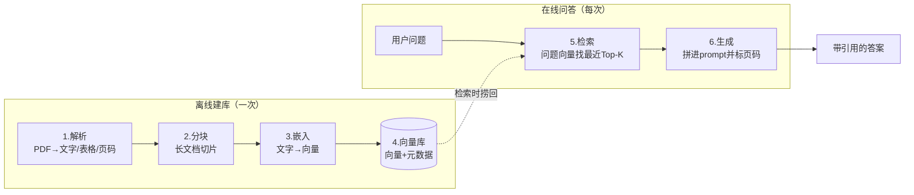

## 摘要

直接问大模型「茅台 2024 年的营收是多少」，你很可能拿到一个看起来合理、实际是编造的数字——这不是 bug，而是大模型的结构性局限：它的知识在训练时被一次性固化，既不认识你的私有资料，也无法溯源到具体出处。

RAG（Retrieval-Augmented Generation，检索增强生成）是目前工程上最务实的解法。本文不堆砌概念，而是把 RAG 的全貌讲清楚:它解决什么问题、由哪六步组成、每一步为什么这么选型。读完你会得到一张可以落地的流水线地图,以及一套贯穿全程、保证答案可溯源的数据契约。

## 1. 问题的根因:大模型的知识是「闭卷」的

打开任意一个通用大模型，问它一个具体而新鲜的问题:

> 贵州茅台 2024 年的营业总收入和归母净利润分别是多少？

你大概率会撞上以下三类回答，**没有一种能直接用于决策**:

| 失败模式 | 表现 | 后果 |
|---|---|---|
| **幻觉 (Hallucination)** | 给出一个看似合理、实为臆造的数字 | 数据错误且难以察觉 |
| **知识截止** | 「我的知识截止到某年，无法回答 2024 年」 | 直接无法回答 |
| **无法溯源** | 给了数字，却答不出「出自年报第几页」 | 无法核验，不可信 |

这三种失败在金融、法务、医疗等高风险场景里每一条都是致命的——你不可能拿一个「可能虚构、还查不到出处」的数字去写研报、做决策。

根因只有一句话:**大模型的参数化知识是在预训练阶段一次性「背」进去的**。它既不知道你私有的、最新的资料，也无法告诉你某句话到底来自哪份文档的哪一页。幻觉问题在学术界已有系统综述,被证明是当前生成式模型的固有挑战而非个别现象（见 Ji et al., *Survey of Hallucination in Natural Language Generation*）。

## 2. RAG 的核心直觉:把「闭卷」改成「开卷」

RAG 由 Facebook AI（现 Meta AI）在 2020 年的论文中正式提出，原始定义是把参数化记忆（预训练模型）与非参数化记忆（外部可检索的知识库）结合（Lewis et al., 2020）。

一句话讲透它的直觉:

> **回答之前，先去资料库里把相关的几页「翻出来」，连同问题一起交给大模型，让它「看着资料回答」。**

用考试做类比，最为直观:

| 维度 | 不带 RAG | 带 RAG |
|---|---|---|
| 考试形式 | 闭卷，全凭记忆 | **开卷**，允许翻书 |
| 答案来源 | 模型记忆（可能记错） | 当场检索到的原文 |
| 能否溯源 | 不能 | **能**，知道答案抄自哪一页 |
| 私有 / 最新数据 | 不知道 | 临时塞进上下文即可用 |

本质上，RAG 把大模型从「背书的学生」变成「会查资料的分析师」。模型的语言组织能力不变，变的是它作答时手边有没有可信的原文。

## 3. 六步流水线:离线建库 + 在线问答

要实现「开卷」，得先把书做成「可快速翻阅」的样子，再在提问时精准翻页。整个过程拆成六步:**前四步是离线建库（只做一次），后两步是在线问答（每次提问都走）**。



逐步拆解，先建立直觉（每一步都值得单开一篇文章做深）:

| 步骤 | 干什么 | 工程关键点 |
|---|---|---|
| **1. 解析** | 把 PDF 里的文字、表格、页码读出来 | 年报含大量表格，解析质量直接决定整条链路的上限 |
| **2. 分块** | 把长文档切成一小片一小片 | 财务表格不能乱切，切碎了数字就失去语义 |
| **3. 嵌入** | 把每片文字变成一串数字（向量） | 让「语义相近」变成「距离相近」，中文年报必须用中文强嵌入模型 |
| **4. 向量库** | 把向量连同元数据（公司/年份/页码）存起来 | 一套库同时做向量检索 + 条件过滤 |
| **5. 检索** | 把问题转成向量，在库里找最近的几片 | 「茅台 vs 五粮液」得先选对公司，否则检索到错公司 |
| **6. 生成** | 把检索到的片段塞进 prompt，据此作答并标页码 | 强制标注引用，查不到就说查不到 |

### 3.1 贯穿六步的数据契约

六步看着是六个独立动作，但从头到尾流动的是**同一种数据结构**——一个带元数据的文本块。它在「分块」时诞生，「向量库」里存下，「检索」时捞回，「生成」时被引用。把这个契约先定义清楚，整条流水线才不会在各步之间反复转换格式:

```ts
// src/types/chunk.ts —— 入库最小单元，贯穿六步不变
export interface ReportChunk {
  id: string;        // 稳定 id 用 `${company}_${year}_${seq}` 拼接，便于增量更新时按公司/年份定位旧块
  content: string;   // 文本块；表格保持 markdown 结构而非纯文本，避免数字与表头错位
  metadata: {
    company: string;    // 公司维度 —— 检索时用作元数据过滤的硬条件，而非靠语义猜
    period: string;     // 报告期如 "2024" —— 同样是过滤条件，隔离不同年份的同类数据
    sourcePage: number; // 原文页码 —— 生成步骤回标引用的依据，是「可溯源」的物理来源
    isTable: boolean;   // 标记表格块，便于下游对表格走不同的分块/渲染策略
  };
}
```

那句反复出现的「元数据（公司/年份/页码）」，落到代码里就是这个 `metadata`。**记住这条数据契约和那张六步流程图**——后续所有工作，都是在把这六步里的某一步做深、做对。

## 4. 嵌入:把语义变成可计算的距离

第 3 步的「嵌入」是很多人卡壳的地方，一句话讲透:

> **嵌入 (Embedding) = 把一段文字映射成一个高维坐标点，意思越接近的文字，坐标离得越近。**

举两个例子:

- 「营业收入」和「营收」 → 坐标几乎重合;
- 「营业收入」和「今天天气」 → 坐标离得很远。

于是「找语义最相关的片段」就变成了一个纯数学问题——在坐标空间里找离问题最近的几个点（常用余弦相似度或内积度量）。

本文采用智源研究院（BAAI）的 **BGE-large-zh** 模型，它会把每段中文映射成一个 **1024 维**的向量（模型卡见 Hugging Face `BAAI/bge-large-zh-v1.5`）。检索时（第 5 步），把用户问题也嵌入到同一空间，算距离、取最近的 Top-K，就是「翻到最相关的那几页」。

### 4.1 检索前先做元数据路由

但光「算距离取 Top-K」还不够。问的是茅台，却可能检索到五粮液——**语义相近不代表是对的公司**。所以检索前先做一步路由:把公司、年份从问题里抽出来，用作硬过滤条件，先把候选范围缩小到正确的子集，再在子集里算语义距离。

```ts
// src/retrieve/parse-query.ts —— 检索前路由：先抽硬过滤条件，避免「问茅台串到五粮液」
export function parseFilter(question: string) {
  const filter: { company?: string; period?: string } = {};
  const company = matchCompany(question);        // 命中实体词典里的公司才过滤，宁缺毋滥
  if (company) filter.company = company;
  const year = question.match(/20\d{2}/)?.[0];   // 用正则兜底年份，避免依赖模型抽取的不确定性
  if (year) filter.period = year;
  return filter;                                 // 抽不到的维度留空，对应步骤就不加该过滤，保证召回
}
```

这就是前面表格里说的「得先选对公司」:**用确定性的元数据过滤兜住语义检索的不确定性**，两者配合才稳。

## 5. 技术选型:原理不变，工具会变

六步流水线是不变的原理，但每一步用什么工具是会变的。本文的选型原则:**面向 TS / 全栈受众，主栈用 [Mastra](https://mastra.ai)，只在 TS 生态薄弱处用 Python 兜底**。

| 步骤 | 选型 | 为什么 |
|---|---|---|
| 解析 | **[MinerU](https://github.com/opendatalab/MinerU)**（Python 微服务） | 开源、中文 + 表格解析最强；TS 生态薄弱，做成 HTTP 微服务隔离边界 |
| 分块 | **Mastra `@mastra/rag`** | 框架原生，结构感知分块 |
| 嵌入 | **[BGE-large-zh](https://huggingface.co/BAAI/bge-large-zh-v1.5)**（经 API） | 中文年报必须中文强嵌入，1024 维 |
| 向量库 | **[Supabase](https://supabase.com/docs/guides/ai)**（Postgres + [pgvector](https://github.com/pgvector/pgvector)） | 一套库同时做向量检索 + 元数据过滤；托管免装、跨平台、门槛最低 |
| 检索 | **Mastra `@mastra/pg`** | 向量相似度 + `WHERE 公司/年份` 过滤，一条 SQL 搞定 |
| 生成 | **[DeepSeek](https://api-docs.deepseek.com)**（经 Mastra） | 中文好、价格低；Mastra 统一接入，换模型不改业务代码 |

诚实说一句:算法岗 JD 仍以 Python 为主。但 **TS 栈更适合 AI 应用 / 全栈方向，且市场更稀缺**。本文只跟 Mastra 一条主线，避免双栈维护拖慢迭代。技术选型的核心不是「哪个最先进」，而是「哪个最匹配你的团队栈和迭代速度」。

### 5.1 把规矩写死在 prompt 里，而不是指望模型自觉

选型可以换、模型可以换。但「**不虚构、标页码、查不到就说查不到**」这条规矩不能靠模型自觉——它必须被显式写进生成步骤的 prompt 约束里:

```ts
// src/generate/answer.ts —— 强制引用溯源 + 资料不足时拒答
export function buildPrompt(question: string, chunks: RetrievedChunk[]): string {
  return [
    '你是严谨的财报分析助手。只依据下面的【上下文片段】回答问题。',
    '要求：',
    // 强制回标页码：把「可溯源」从可选项变成输出格式的硬约束
    '1) 答案末尾标注引用，格式 (公司·年份年报·P页码)；',
    // 显式授权模型「拒答」：不给这条，模型默认倾向于编一个答案来满足提问
    '2) 若上下文不足以回答，明确回答"未在所给资料中检索到"，绝不编造数字。',
    '',
    `# 上下文片段\n${formatContext(chunks)}`,
    `# 问题\n${question}`,
  ].join('\n');
}
```

第 1 节里的「幻觉」和「无法溯源」这两宗罪，就堵在这段 prompt 上。检索保证模型手边有原文，prompt 约束保证模型只敢用原文——两者缺一不可。

## 6. 小结

1. **直接问大模型有三宗罪**:会虚构、知识过期、无法溯源——金融场景里每一条都致命。
2. **RAG 把「闭卷」改成「开卷」**:先检索相关原文，再让模型看着原文作答。
3. **整条链路是六步流水线**:解析 → 分块 → 嵌入 → 向量库 → 检索 → 生成，贯穿其中的是一份带元数据的数据契约。
4. **原理不变，工具会变**:本文主栈 Mastra (TS)，解析用 MinerU 兜底；选型看的是匹配度，不是先进度。

下一篇我们将从零搭建 RAG 实验台，把这条六步流水线真正跑通。

## 延伸阅读

- [Lewis et al., *Retrieval-Augmented Generation for Knowledge-Intensive NLP Tasks* (2020)](https://arxiv.org/abs/2005.11401) —— RAG 的原始论文，理解设计动机的源头
- [pgvector 官方仓库](https://github.com/pgvector/pgvector) —— Postgres 向量检索扩展，理解向量库底层
- [Mastra 官方文档](https://mastra.ai/docs) —— 本文主栈框架，RAG 与模型接入的工程实现

## 最后

- 完整可运行的 Demo 代码与逐步实现，将在系列后续文章中开源到 GitHub 仓库（敬请关注）。
- 你现在用大模型处理过私有数据或最新数据吗？遇到过哪些坑？欢迎在仓库 Issue 中提出技术问题，一起讨论。
