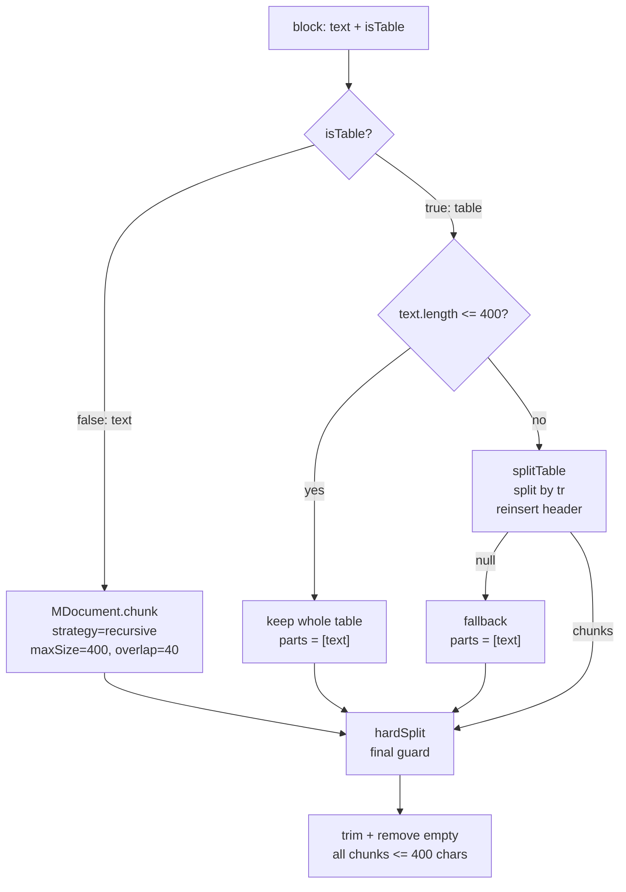

# RAG 表格分块工程指南: 为什么不能按字数盲切

## 摘要

很多 RAG 系统的效果问题, 不一定出在模型. 更常见的原因是: 入库前的 chunk 已经把语义切坏了. 对正文来说, 递归分块和 overlap 往往还能保住上下文. 对表格来说, 一旦表头和数据行分离, 数字就失去了身份.

本文给出一个财报 RAG 中的最小可落地方案: 正文继续走递归分块, 表格走结构感知切分, 每个表格分片都重新带上表头, 最后用 `hardSplit` 兜住长度红线. 目标不是让分块逻辑变复杂, 而是让进入向量库的证据仍然完整.

## 问题背景: 分块不是排版问题

RAG 入库链路通常会经历这几步:

1. 解析文档, 例如 PDF, HTML, Markdown.
2. 切分文档, 生成多个 chunk.
3. 对 chunk 做 embedding.
4. 写入向量库.
5. 检索时取回相关 chunk, 交给模型生成答案.

分块的约束来自 embedding 模型的输入长度. 以 `BAAI/bge-large-zh` 为例, Hugging Face 上的配置显示 `max_position_embeddings` 和 `model_max_length` 都是 `512`. 这意味着工程上不能把一整页年报或一整张财务表直接塞进单次 embedding 请求.

参考:

- [BAAI/bge-large-zh config.json](https://huggingface.co/BAAI/bge-large-zh/blob/main/config.json)
- [BAAI/bge-large-zh tokenizer_config.json](https://huggingface.co/BAAI/bge-large-zh/blob/main/tokenizer_config.json)

块太大, 可能触发请求体过大或模型侧输入限制. 块太小, 会切碎上下文. 分块真正要解决的不是"切成几段", 而是在输入上限和语义完整性之间做取舍.

正文和表格的语义边界不同:

- 正文主要依赖段落, 句子, 标题层级.
- 表格主要依赖表头, 行, 列的对应关系.

所以正文可以递归切. 表格不能简单按字符数盲切.

## 工程红线: MAX_CHARS 不要贴着模型上限

先把单个 chunk 的长度红线写进代码:

```ts
// src/lib/chunk.ts

/**
 * 单个 chunk 的字符上限.
 *
 * 设计意图:
 * - 低于 bge-large-zh 的 512 token 输入边界, 给中英文混排和符号留安全裕量.
 * - 为正文 overlap 预留空间, 避免递归分块后再撞模型上限.
 * - 把失败前移到本地切分层, 不把建库稳定性交给远端 embedding 端点.
 */
export const MAX_CHARS = 400;
```

这里选择 `400`, 而不是贴着 `512` 切, 是一个稳定性判断.

`512` 是模型边界. `400` 是工程安全线. 中文字符和 token 大致接近, 但不是严格一比一. 真实输入里还会有英文, 数字, 标点, HTML 标签和换行. 贴边设计会让系统在脏数据里反复暴露偶发失败.

如果正文分块使用 `overlap: 40`, 那么 `400 + 40` 仍然低于 `512`. 多切几块会增加存储成本, 但可以换来更稳定的建库链路.

## 表格盲切会破坏列名和数字的关系

财报表格解析后, 经常会得到一段 HTML:

```html
<table>
  <tr>
    <td>项目</td>
    <td>本期金额</td>
    <td>上期金额</td>
  </tr>
  <tr>
    <td>营业收入</td>
    <td>1741.44</td>
    <td>1505.60</td>
  </tr>
  <tr>
    <td>营业成本</td>
    <td>...</td>
    <td>...</td>
  </tr>
</table>
```

`1741.44` 本身没有业务意义. 它必须和"营业收入"以及"本期金额"绑定在一起, 才能成为可回答问题的证据.

如果按 400 字盲切, 可能得到这样的片段:

```text
片段 0:
<table> 表头: 项目 | 本期金额 | 上期金额
营业收入 | 1741.44 | 1505.60
营业成本 | ...

片段 1:
营业利润 | 932.65 | ...
净利润 | ...
</table>
```

片段 1 仍然有数字, 但表头丢了. 向量检索可能命中这个片段, 因为它包含"营业利润"和相关数字. 问题是模型拿到的证据不完整, 它不知道 `932.65` 属于本期金额, 上期金额, 还是其他列.

这类问题最难排查, 因为系统表面上仍然在工作:

- 文档解析成功.
- chunk 成功.
- embedding 成功.
- 检索有结果.
- 回答看起来也像答案.

但证据链已经断了.

## 解决方案: 按表头和数据行切表格

表格切分的原则很简单:

1. 不按字符位置切表格.
2. 按 `<tr>` 行切.
3. 第一行作为表头.
4. 每个分片都重新带上表头.
5. 分片仍然不能超过长度红线.

核心实现如下:

```ts
// src/lib/chunk.ts

/**
 * 将 HTML 表格切成多个结构完整的片段.
 *
 * 设计意图:
 * - 用第一行作为表头, 让每个分片都保留列名.
 * - 按数据行贪心打包, 避免在单元格中间切断 HTML.
 * - 无法识别表格结构时返回 null, 让上层统一走兜底切分.
 */
function splitTable(html: string, max: number): string[] | null {
  const tableStart = html.search(/<table[\s>]/i);
  if (tableStart === -1) return null;

  // caption 可能包含表格标题, 单位说明或来源说明. 每片保留它, 便于检索结果自解释.
  const caption = html.slice(0, tableStart).trim();
  const prefix = caption ? `${caption}\n` : '';

  // 只处理能拆出多行的表格. 行结构不足时不冒进, 交给 hardSplit 保安全.
  const rows = html.match(/<tr[\s\S]*?<\/tr>/gi);
  if (!rows || rows.length < 2) return null;

  const [header, ...dataRows] = rows;
  const out: string[] = [];
  let buf: string[] = [];

  // render 集中负责回插表头, 避免循环里散落拼接逻辑.
  const render = (bodyRows: string[]) => `${prefix}<table>${header}${bodyRows.join('')}</table>`;

  for (const row of dataRows) {
    const next = [...buf, row];

    // 当前片超过上限且已有内容时, 先收口上一片, 再从当前行开始新片.
    if (render(next).length > max && buf.length >= 1) {
      out.push(render(buf));
      buf = [row];
    } else {
      buf = next;
    }
  }

  if (buf.length) out.push(render(buf));
  return out;
}
```

关键点不是正则本身, 而是这条不变量:

> 每个表格分片都必须包含同一个表头.

只要这个不变量成立, 数据行里的数字就不会变成孤立证据.

## 正文和表格分流处理

入口函数应该先识别 block 类型. 正文和表格走不同策略:

```ts
// src/lib/chunk.ts

export async function chunkBlock(text: string, isTable: boolean): Promise<string[]> {
  let parts: string[];

  if (isTable) {
    // 表格短于红线时整表保留, 因为完整表格比拆分片段更有语义价值.
    parts = text.length <= MAX_CHARS ? [text] : (splitTable(text, MAX_CHARS) ?? [text]);
  } else {
    const doc = MDocument.fromMarkdown(text);

    // 正文保留 recursive 策略和 overlap, 优先沿自然语言边界切分.
    const chunks = await doc.chunk({
      strategy: 'recursive',
      maxSize: MAX_CHARS,
      overlap: 40,
    });

    parts = chunks.map((c) => c.text);
  }

  // 统一兜底: 无论上游策略如何, 最终入库片段都不能突破 MAX_CHARS.
  return parts
    .flatMap((p) => hardSplit(p, MAX_CHARS))
    .map((s) => s.trim())
    .filter(Boolean);
}
```

Mastra 官方文档中, `MDocument` 支持从 Markdown 创建文档, 并通过 `chunk` 使用 `recursive`, `character`, `token`, `markdown`, `html` 等多种策略. 这里正文继续使用 `recursive`, 是为了缩小改动面. 表格问题只在表格路径解决, 不影响正文块数量.

参考:

- [Mastra: Chunking and embedding documents](https://mastra.ai/docs/rag/chunking-and-embedding)

## 兜底函数: 最后一层安全网必须在自己手里

第三方分块器可以提高效率, 但生产链路不应该完全依赖它保证最终长度. 一个简单的 `hardSplit` 可以作为最后一道安全网:

```ts
// src/lib/chunk.ts

/**
 * 将任意超长文本硬切到 max 以内.
 *
 * 设计意图:
 * - 上游结构化切分失败时, 仍然保证 embedding 输入不会超限.
 * - 优先按换行切, 尽量保住段落和表格行边界.
 * - 单行仍然超长时再按字符硬切, 这是最后兜底, 不是首选策略.
 */
function hardSplit(text: string, max: number): string[] {
  const out: string[] = [];
  let buf = '';

  for (const line of text.split('\n')) {
    const next = buf ? `${buf}\n${line}` : line;

    if (next.length <= max) {
      buf = next;
      continue;
    }

    if (buf) out.push(buf);

    // 单行过长时只能硬切. 这里牺牲局部语义, 换取整个入库链路不失败.
    for (let i = 0; i < line.length; i += max) {
      out.push(line.slice(i, i + max));
    }

    buf = '';
  }

  if (buf) out.push(buf);
  return out;
}
```

这层兜底的意义是: 分块策略可以优化, 但长度红线不能协商.

## 实测结果: 用块数换语义

同一批 6 份年报, 分别用旧版盲切和新版结构感知切分跑一遍, 结果如下:

| 指标 | 盲切 before | 结构感知 after | 变化 |
|---|---:|---:|---:|
| 总块数 | 17499 | 25159 | +7660, +44% |
| 表格块 | 7861 | 15521 | +7660, 约 1.97 倍 |
| 正文块 | 9638 | 9638 | 0 |

逐文件结果:

| 文件 | before | after | 变化 |
|---|---:|---:|---:|
| maotai_2023 | 2962 | 4157 | +1195 |
| maotai_2024 | 3122 | 4381 | +1259 |
| maotai_2025 | 3167 | 4432 | +1265 |
| wuliangye_2023 | 2818 | 4251 | +1433 |
| wuliangye_2024 | 2749 | 4050 | +1301 |
| wuliangye_2025 | 2681 | 3888 | +1207 |

这里有两个结论:

1. 正文块数量没有变化, 说明改动只影响表格路径.
2. 总块增量和表格块增量完全一致, 说明新增成本都来自表头回插和表格拆分.

结构感知切分会增加块数. 原因很直接: 每片都重复带表头, 字符量变大, 在 `MAX_CHARS = 400` 的约束下自然会切出更多片.

在金融 RAG 里, 这笔账通常值得. 一个缺失表头的表格块, 存储成本再低, 也是低质量证据. 它会让系统更容易生成看似准确但证据不完整的回答.

## 边界告警: 中间 chunk 超长不等于最终入库超长

构建过程中可能出现这样的日志:

```text
maotai_2023.pdf: 4157 chunks
Created a chunk of size 425, which is longer than the specified 400
maotai_2024.pdf: 4381 chunks
maotai_2025.pdf: 4432 chunks
wuliangye_2023.pdf: 4251 chunks
wuliangye_2024.pdf: 4050 chunks
wuliangye_2025.pdf: 3888 chunks
```

这类日志需要拆开看. 如果它来自正文路径里的递归分块器, 说明上游策略产出了一个 425 字的中间片段. 但只要最终入库前还经过统一的 `hardSplit`, 最终 chunk 仍然可以被压回 `400` 以内.

验证时不要只看分块器日志, 要检查最终入库数据:

```ts
// test/chunk.test.ts

import { describe, expect, it } from 'vitest';
import { chunkBlock, MAX_CHARS } from '../src/lib/chunk';

describe('chunkBlock', () => {
  it('keeps table headers in every table chunk', async () => {
    const html = `
      <table>
        <tr><td>项目</td><td>本期金额</td><td>上期金额</td></tr>
        <tr><td>营业收入</td><td>1741.44</td><td>1505.60</td></tr>
        <tr><td>营业成本</td><td>900.00</td><td>800.00</td></tr>
      </table>
    `;

    const chunks = await chunkBlock(html, true);

    // 设计意图: 表格分片可以变多, 但每片都必须保留列名上下文.
    expect(chunks.every((chunk) => chunk.includes('本期金额'))).toBe(true);

    // 设计意图: 业务数据不能在结构化切分过程中丢失.
    expect(chunks.join('\n')).toContain('营业收入');

    // 设计意图: 最终入库片段必须满足 embedding 输入红线.
    expect(chunks.every((chunk) => chunk.length <= MAX_CHARS)).toBe(true);
  });
});
```

真正的验收标准不是"代码跑了", 而是三件事同时成立:

- 表头仍在.
- 数据行没丢.
- 最终 chunk 没有超过长度红线.

## 流程图



Mermaid 的 flowchart 语法适合把这种分流逻辑放进技术文章, 方便读者快速确认边界和兜底路径.

参考:

- [Mermaid Flowcharts syntax](https://mermaid.js.org/syntax/flowchart.html)

## 当前方案的局限

这套方案只解决最常见的财报表格问题: 表很多, 行很多, 但每行没有极端长.

它仍然有两个局限.

### 1. 超宽单行仍然可能受损

如果"表头 + 单条数据行"本身就超过 `400` 字, `splitTable` 也无法在保留完整行列关系的同时满足长度红线. 最后仍然会落到 `hardSplit`.

这种场景需要更细的表格模型, 例如:

- 把一张宽表按列组拆分.
- 给每个单元格补充行标题和列标题.
- 把表格转成三元组或 JSON 结构后再入库.

### 2. 正文还没有充分感知标题层级

正文当前使用 `recursive` 策略, 能沿常见分隔符切分, 但不一定理解中文文章里的标题层级. 更理想的做法是优先让 chunk 落在完整小节内, 标题作为 metadata 或前缀进入 chunk.

这不是同一个问题. 表格丢表头会直接破坏证据身份, 优先级更高. 正文标题层级可以作为下一轮优化.

## 结论

RAG 分块不是按字数切文本, 而是按语义边界切知识.

正文的语义边界通常是段落, 句子和标题. 表格的语义边界是表头, 行和列. 把两者放进同一套字符切分规则里, 系统会看起来简单, 但检索证据会变脆.

一个可落地的生产方案至少需要三层:

1. `MAX_CHARS = 400`: 建立稳定性红线.
2. `splitTable`: 表格按结构切, 每片回插表头.
3. `hardSplit`: 最终兜底, 保证所有入库 chunk 不超限.

如果你的文档 RAG 已经开始处理财报, 合同, 研报或采购清单, 不要只看回答是否"像对的". 先抽几条命中的 chunk 出来检查: 数字是否还认识自己的列名, 数据是否还带着完整上下文.

模型可以推理. 模型不能替你恢复已经切坏的证据.

## 延伸阅读

- [Mastra: Chunking and embedding documents](https://mastra.ai/docs/rag/chunking-and-embedding)
- [BAAI/bge-large-zh model card](https://huggingface.co/BAAI/bge-large-zh)
- [Mermaid Flowcharts syntax](https://mermaid.js.org/syntax/flowchart.html)

